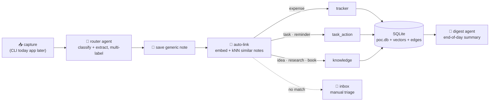

<p align="center">
  <picture>
    <source media="(prefers-color-scheme: dark)" srcset="docs/logo-dark.svg">
    
  </picture>
</p>

<p align="center">
  
  
  
  
</p>

**Dropstone** is a personal capture app with an AI brain. Type (later: say, or snap) anything  an expense, a half-formed idea, a book someone mentioned, a "remind me tonight"  and drop it. A router agent reads the raw text, figures out what it *is*, extracts the structured fields, and files it into the right place(s) automatically. No forms, no folders, no deciding where things go. Over time, every capture joins a personal knowledge graph that connects your ideas, research, purchases, and people to each other.

> 🎬 **Demo GIF coming soon** The project is currently a headless proof-of-concept (CLI only). Live captures, the graph view, and the daily dashboard will be showcased here once the client apps exist.

---

## What it looks like today

```text
$ python capture.py "grabbed coffee with Manish, 6 bucks at blue tokai"

raw:    grabbed coffee with Manish, 6 bucks at blue tokai
note_id: 14
routed:
  - expense (confidence=0.95)
stored:
  - expense row #4: {"amount": 6.0, "currency": "USD", "category": "coffee", "merchant": "Blue Tokai", ...}
linked (auto, embedding similarity):
  - note #11 (sim=0.68): talk to Manish
  - note #12 (sim=0.66): spent 15$ on lunch at 2 pm
```

The router supports **multi-label dispatch**  one capture, several homes ("bought Atomic Habits for 15 bucks" is an expense *and* a book at once). Every capture is also embedded on save and **auto-linked** to semantically similar past notes  no tags, no manual linking. Captures that match nothing are never dropped: they land in a fallback **inbox** for manual triage.

## Core ideas

- **Zero-friction capture.** The whole product bet: if saving a thought takes more than a couple of seconds, you won't do it. Capture first, organize never  the agent organizes.
- **Nodes, not features.** Every domain (expenses, tasks, reminders, ideas, research, books  later CRM, health, journaling, deliveries, and more) is a self-contained *node* with its own schema, extraction logic, confirm policy, and view. Adding a domain never touches the others.
- **A knowledge graph underneath.** Every capture becomes a generic note that gets embedded (vector, on-device) and auto-linked to related past notes via kNN similarity  so "5 related ideas from three weeks ago" surface themselves. Links carry provenance (`inferred` from similarity vs `explicit` from structure). *(Built  interactive graph view comes with the UI.)*
- **Bring your own model.** Router + digest run on any LangChain-supported chat model: Anthropic (default), OpenAI, or local Ollama  one env var (`DROPSTONE_MODEL`) to switch.
- **Local-first.** Your data lives in SQLite on your device. Works offline, private by default. A sync server (Postgres) enters later only to keep multiple devices in sync.
- **Meta-agents on top.** Agents that read *across* nodes: end-of-day digest (built), daily dashboard, chief-of-staff triage, pattern detection (planned).

## How it works



Built on **LangGraph**: the router is one graph node; matches fan out in parallel (`Send` API) to category dispatchers grouped by confirm-policy family (`tracker`, `task_action`, `knowledge`, and a reserved `relationship` for the future CRM). Every capture writes a generic `notes` row plus one structured row per matched node type. The database upgrades itself via versioned migrations (`PRAGMA user_version`)  your data survives every schema change.

## Node catalog

**Live now (6):**

| Node | Captures | Extracted fields |
|---|---|---|
| 💸 Expense | "spent 40 on groceries" | amount, currency, category, merchant, date |
| ✅ Task | "buy milk and eggs" | text, status, due date, priority |
| ⏰ Reminder | "call mom tomorrow at 6pm" | text, due time or place, status |
| 💡 Idea | "app idea: recipe generator from fridge photos" | idea text, source, tags |
| 🔬 Research | pasted article link, "keep an eye on X" | URL, summary, key points, topic, monitoring flag |
| 📚 Book | "started Atomic Habits, chapter 3" | title, URL, status (want/reading/done), progress |

**Planned** (each is just a new node against the same contract): Personal CRM · Commitments · Calendar/Meetings · Spaced Repetition · Daily Journal · Decision Journal · Health/Mood · Wishlist · Deliveries/Orders  plus a cross-node **Daily Dashboard** (today's expenses, events, tasks, reminders, deliveries on one screen).

## Router quality

<!-- An eval suite (`eval.py`) locks in router behavior  18 cases covering every node type, multi-label captures, ambiguous phrasings, and gibberish-to-inbox fallback. Current score: **18/18**. It runs before/after any change to the node catalog, system prompt, or model. -->
An eval suite (`eval.py`) in works that can cover every node type, multi-label captures, ambiguous phrasings, and gibberish-to-inbox fallback.

---

## Install (development)

> ⚠️ Dropstone is a **pre-alpha proof of concept**  a headless Python backend, CLI only. There is no app to install yet. These steps set up the dev environment. A proper install guide (mobile + desktop apps) will land here when the client shells exist.

**Prerequisites:** Python 3.11+, and an [Anthropic API key](https://console.anthropic.com/) (default)  or any other LangChain-supported chat model, including local Ollama (see `DROPSTONE_MODEL` below).

```bash
git clone <this-repo>
cd dropstone

python -m venv venv
venv\Scripts\activate        # Windows
# source venv/bin/activate   # macOS / Linux

pip install -r requirements.txt

copy .env.example .env       # Windows  (cp on macOS/Linux)
# then edit .env and set ANTHROPIC_API_KEY=sk-ant-...
```

Optional, in `.env`:
| Variable | Purpose | Default |
|---|---|---|
| `ANTHROPIC_API_KEY` | LLM calls with the default model | *(required for default)* |
| `DROPSTONE_MODEL` | Chat model, `provider:model`  e.g. `openai:gpt-4.1-mini`, `ollama:llama3.1` (needs that provider's key + `langchain-<provider>` package installed) | `anthropic:claude-sonnet-5` |
| `LANGSMITH_TRACING` / `LANGSMITH_API_KEY` | Dev-only tracing of every run in LangSmith | off |
| `EMBEDDING_PROVIDER` | `local` (on-device, free) or `voyage` (cloud API) | `local` |

## Usage

**Capture anything:**
```bash
python capture.py "spent 40 on groceries"
python capture.py "remind me to take my medicine at 9am"
python capture.py "what if the daily digest ranked items by urgency instead of time"
```

**See what a note is connected to** (graph retrieval, no LLM calls):
```bash
python related.py 14           # direct neighbors
python related.py 14 --hops 2  # ...and neighbors-of-neighbors
```

**Backfill embeddings + links** for notes captured before Phase 2 (safe to re-run):
```bash
python backfill.py
```

**Review the fallback inbox** (unrouted + low-confidence captures, no LLM calls):
```bash
python inbox.py
```

**End-of-day digest** (LLM summary of today's captures, grouped, with cross-node connections called out):
```bash
python digest.py
```

**Run the router eval** before/after changing the catalog, prompt, or model:
```bash
python eval.py
```

**Visual debugging**  inspect every routing decision as a graph in LangGraph Studio:
```bash
langgraph dev
```

**Vector-stack smoke test** (in-memory, touches nothing in `poc.db`):
```bash
python spike_vec.py
```

## Project layout

```
capture.py     CLI entry  one raw capture through the full pipeline
graph.py       LangGraph wiring: router → save_note → auto_link → parallel category dispatch
schemas.py     Pydantic models the router fills (RouteResult, per-node fields)
db.py          SQLite storage, versioned migrations, edges + vector helpers
llm.py         chat-model abstraction (Anthropic / OpenAI / Ollama via DROPSTONE_MODEL)
embeddings.py  embedding provider abstraction (local fastembed / Voyage cloud)
related.py     graph retrieval CLI  what's connected to note N (recursive CTE)
backfill.py    embed + auto-link notes captured before Phase 2
inbox.py       fallback inbox  unrouted / low-confidence captures
digest.py      end-of-day cross-node summary agent
eval.py        router regression suite (18 cases)
spike_vec.py   throwaway spike proving sqlite-vec + embeddings work locally
poc.db         your data (gitignored in real use)
```

## Roadmap

- [x] **Phase 1  substrate + first nodes:** capture → router → storage loop, 6 node types, inbox, digest, eval, tracing
- [x] **Phase 2  knowledge graph:** embeddings on save, kNN auto-linking, `edges` table with provenance (explicit vs inferred), related-notes retrieval, bring-your-own-model *(graph UI view lands with the client apps)*
- [ ] **Phase 3  people & gated actions:** CRM, commitments, calendar with hard-confirm, Google OAuth, daily dashboard, client/server split
- [ ] **Phase 4  reflection nodes:** journaling, decision journal, health/mood, spaced repetition, wishlist
- [ ] **Phase 5  meta-agents + multi-tenant sync:** chief-of-staff triage, pattern detection, synthesis, Postgres sync server
- [ ] Client apps: React Native (mobile) + Tauri (desktop), sharing one core, talking to this backend

## Architecture decisions (short version)

- **Why one DB engine and not a graph DB:** relatedness here comes from *embedding distance*, not graph structure  vector search discovers the links, a plain `edges` table remembers them, and recursive CTEs handle the shallow (1–3 hop) traversals this app needs. SQLite + `sqlite-vec` locally, Postgres + `pgvector` on the sync server: same shapes, dumb sync.
<!-- - **Why the LLM runs server-side (later):** API keys can't ship inside an app binary  extractable. The agent backend becomes a service clients call; the CLI PoC already mirrors that boundary. -->
- **Why migrations from day one:** the schema will change constantly as nodes are added; `PRAGMA user_version` + an append-only migration list means no database ever gets wiped for a schema change.

## License

[MIT](LICENSE) © 2026 Gandhrav
